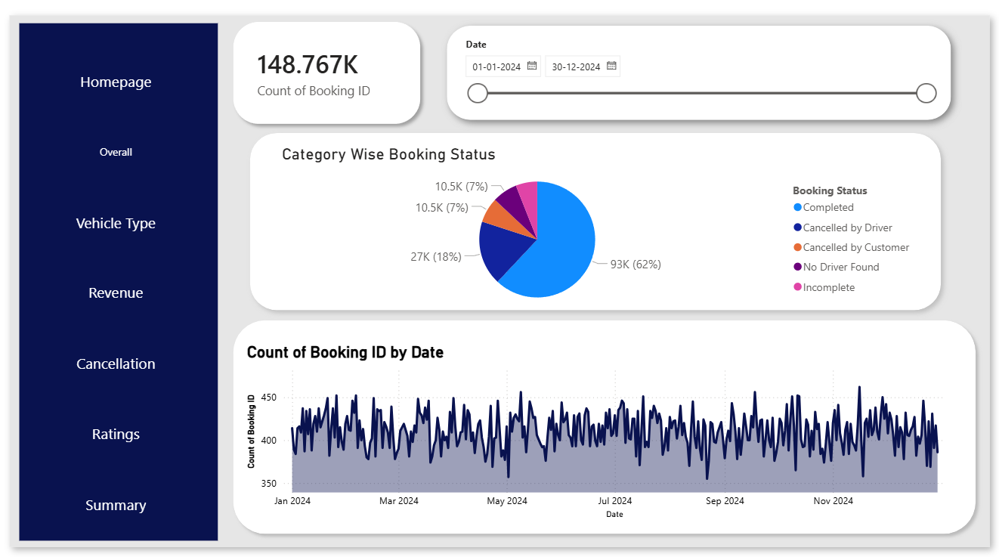
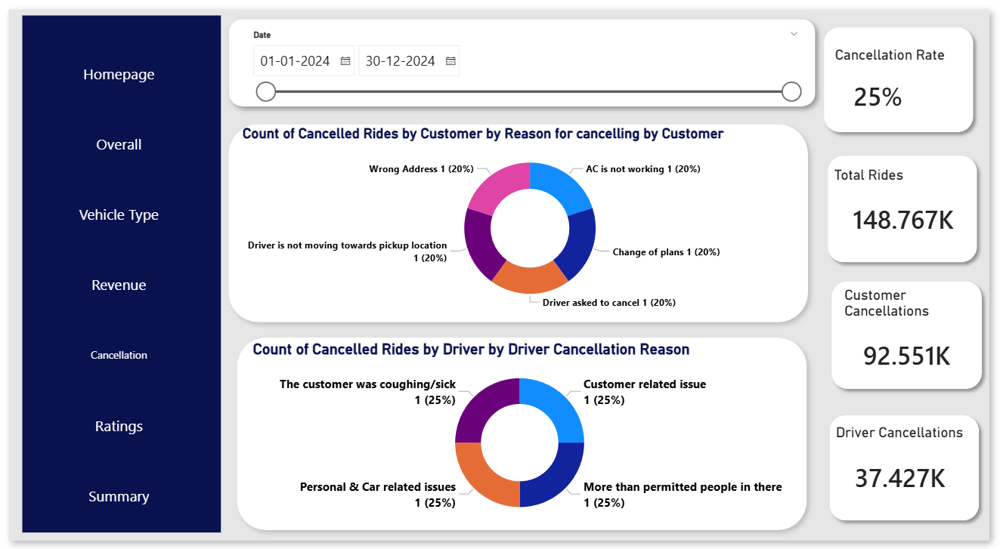
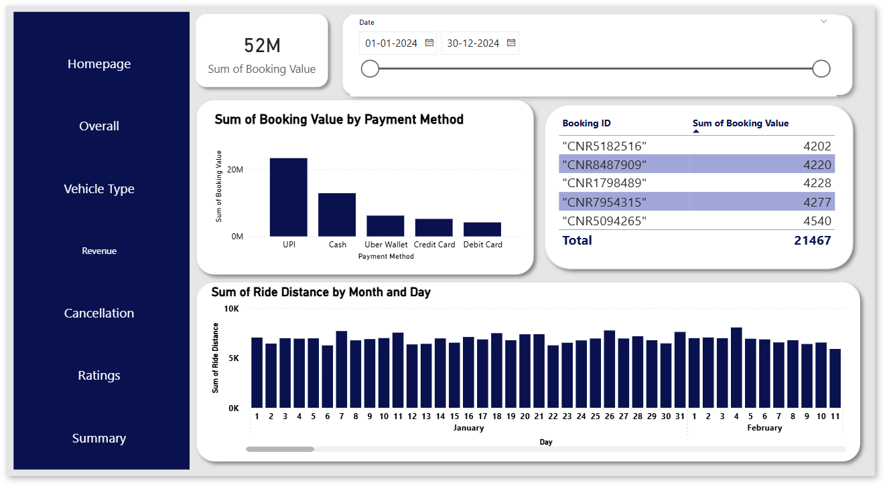
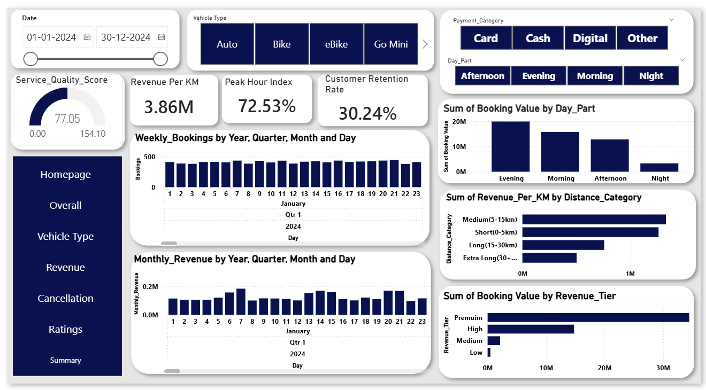
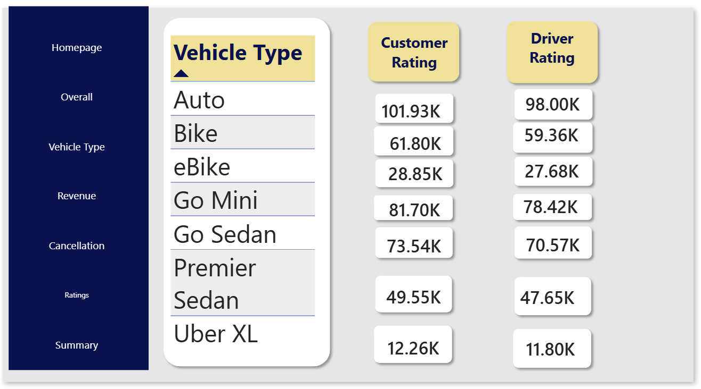
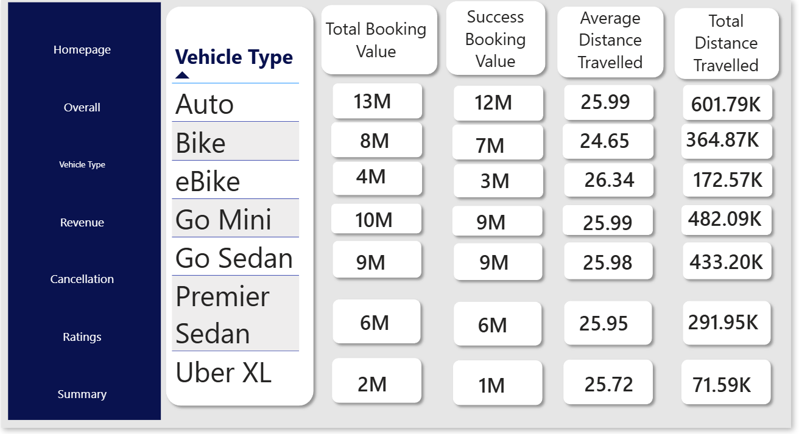

# Taxi Fare Analysis & Business Intelligence Dashboard

## 📌 Business Problem & Objectives
A regional ride-hailing and taxi platform experienced unpredictable revenue fluctuations, unoptimized fleet distribution during peak hours, and potential customer churn due to unseen operational friction. Without aggregated data, management lacked visibility into driver performance, demand velocities, and pricing health.

**Project Objective:** 
To analyze over 148,000 historical trips to identify hidden revenue patterns, map high-velocity demand windows, and track core loyalty metrics to maximize daily profitability and optimize fleet management.

---

## 💡 Key Business Insights & Data Solutions

### 1. Revenue & Demand Optimization

- **The Problem:** Fleet misallocation during high-demand windows leading to lost passenger bookings.
- **The Insight:** Identified a **72.53% Peak Hour Index**, highlighting massive revenue opportunities clustered during tight, high-velocity windows.
- **Business Action:** Enabled operations to deploy targeted driver incentives and surge pricing strategies to maximize trip fulfillment during peak intervals.

### 2. Customer Retention & Service Health

- **The Problem:** High operational customer acquisition costs vs. unknown churn rates.
- **The Insight:** Monitored customer stickiness indicating a stable **30.24% Customer Retention Rate**.
- **Business Action:** Establishes an early-warning baseline for marketing teams to trigger loyalty campaigns and discounts if repeat customer metrics drop.

### 3. Pricing & Value Velocities

- **The Problem:** Standard uniform pricing models failing to capture time-of-day valuation.
- **The Insight:** Mapped booking value velocities across distinct Day Parts (Morning, Afternoon, Evening, Night) alongside month-over-month trends.
- **Business Action:** Allows management to optimize shifts and implement dynamic pricing strategies based on temporal value variations.

### 4. Executive Summary & Macro Trends

- **The Problem:** High-level executives needing a unified, consolidated view of macro-trends without getting lost in granular transaction logs.
- **The Insight:** Compiled a multi-dimensional summary performance view to monitor overall business momentum and trip distribution velocity simultaneously.
- **Business Action:** Provides leadership with a strategic single-pane-of-glass interface to align quarterly growth strategies with real-time operational performance.

### 5. Ratings Analytics

- **The Insight:** Aggregated over **101.93K customer ratings** and **98.00K driver ratings** to assess service delivery.
- **Business Action:** Isolates low-performing service segments to introduce driver training programs and protect platform reputation.

### 6. Vehicle Type Performance

- **The Insight:** Segmented revenue performance across vehicle categories (Auto, Bike, Mini, Prime Sedan, Prime SUV).
- **Business Action:** Guides strategic fleet expansion and targeted vehicle marketing based on individual type margins.

---

## 🛠️ Technical Stack & Implementation
- **Tool:** Microsoft Power BI Desktop
- **Data Modeling:** Developed a robust Star-Schema data model connecting facts and dimensions.
- **Calculations:** Formulated custom DAX measures for KPI metrics, retention scoring, and time-intelligence tracking.
- **UI Design:** Built a multi-page interactive user interface focused on drill-down performance metrics.

---

## 📁 Download Project Files
All development and compressed files are cleanly organized inside the repository folder structure. 

To download the project resources:
1. Navigate to the [powerbi-files/](powerbi-files/) folder at the top of this repository page.
2. Click on either `TaxiFare Dashboard.pbix` or `TaxiFare Dashboard.zip`.
3. Click the **Download raw file** button (the download arrow icon) on the right side of the screen to save it to your local machine.
